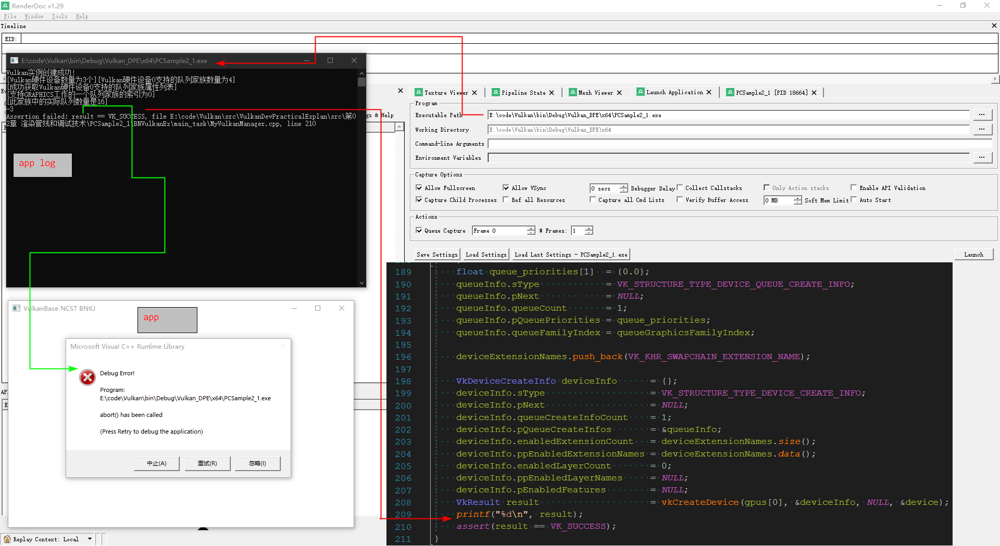

# renderdoc_for_vulkanApp
this is a program for useing renderdoc to debug vulkan app demo


# note


## using VS2019 to compile 

the PCSample2_1.sln is 

```none
..\renderdoc_for_vulkanApp\src\PCSample2_1\build\PCSample2_1.sln
```


## modify the shader's path right in the file of PathData.h

```c++
// PathData.h
#ifndef PathData_H
#define PathData_H

#define PathPre "E:/code/renderdoc_for_vulkanApp/src/PCSample2_1/BNVulkanEx/"

#define VertShaderPath PathPre##"shaders/commonTexLight.vert.spv"
#define FragShaderPath PathPre##"shaders/commonTexLight.frag.spv"

#endif
```


## the app Compilation results "PCSample2_1.exe" 

in this folder

```
..\renderdoc_for_vulkanApp\src\PCSample2_1\bin\Debug\Vulkan_DPE\x64
```


# tips

> when you compile the app ,you must install [vulkan SDK ](https://www.lunarg.com/vulkan-sdk/)


# error

## Renderdoc launch vulkan's pc app demo ,the app execute exception

> ​    The Vulkan program compiled with Visual Studio 2019 can be debugged directly through vs2019, but when starting with RenderDoc, the execution of vkCreateDevice failed with the error code VK_ ERROR_ INITIALIZATION_ FAILED.
>
> ​    I serach the error code VK_ ERROR_ INITIALIZATION_ FAILED by the website 【https://registry.khronos.org/vulkan/specs/1.3-extensions/html/vkspec.html#VkResult】, but I also not too solve the problem    
>
> ​    so t think whether or not the renderdoc need to configure other properties for vulkan。（I use renderdoc to launch dx11 or dx12 program is smooth）




## [*renderdoc*’s official site](https://www.baidu.com/link?url=F0Fqqk0elbo1CxFC8y2DfVj2xqE3qPgmPp3nETMQD9a&wd=&eqid=e6cf4076000045050000000265421f63)
